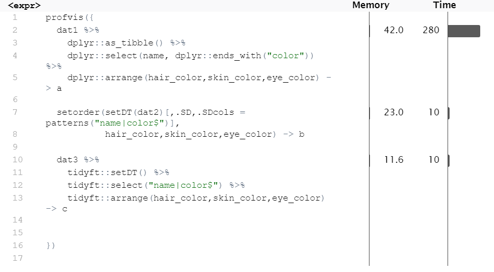

# tidyft: Tidy Verbs for Fast Data Operations by Reference

<!-- badges: start -->

 [](https://cran.r-project.org/package=tidyft) [](https://r-pkg.org/pkg/tidyft) 

<!-- badges: end -->

## Overview
*tidyft* is an extension of [data.table](https://github.com/Rdatatable/data.table). Using modification by reference whenever possible, this toolkit is designed for big data analysis in high-performance desktop or laptop computers. The syntax of the package is similar or identical to [tidyverse](https://github.com/tidyverse/tidyverse). It is user friendly, memory efficient and time saving. For more information, check its ancestor package [tidyfst](https://github.com/hope-data-science/tidyfst).

This design is best for big data manipulation on out of memory data using facilities provided by [fst](https://hope-data-science.github.io/tidyft/reference/fst.html). In such ways, you can handle the most quantity of data in the least time and space on your computer.

## Installation

You can install the released version of tidyft via:

``` r
install.packages("tidyft") 
```

## Example

This is a basic example which shows you how to solve a common problem:

``` r
library(tidyft)

# get first 5 rows of iris
as.data.table(iris)[1:5] -> a
#show
a
#>    Sepal.Length Sepal.Width Petal.Length Petal.Width Species
#> 1:          5.1         3.5          1.4         0.2  setosa
#> 2:          4.9         3.0          1.4         0.2  setosa
#> 3:          4.7         3.2          1.3         0.2  setosa
#> 4:          4.6         3.1          1.5         0.2  setosa
#> 5:          5.0         3.6          1.4         0.2  setosa

# if you select
a %>% select(1:3)
#>    Sepal.Length Sepal.Width Petal.Length
#> 1:          5.1         3.5          1.4
#> 2:          4.9         3.0          1.4
#> 3:          4.7         3.2          1.3
#> 4:          4.6         3.1          1.5
#> 5:          5.0         3.6          1.4

# you lose the unselected columns forever
a
#>    Sepal.Length Sepal.Width Petal.Length
#> 1:          5.1         3.5          1.4
#> 2:          4.9         3.0          1.4
#> 3:          4.7         3.2          1.3
#> 4:          4.6         3.1          1.5
#> 5:          5.0         3.6          1.4

```

If you still want to keep the original data, use `copy()` to make a copy beforehand.

## Tutorial

See [vignettes](https://hope-data-science.github.io/tidyft/).

## Performance

```


rm(list = ls())

library(profvis)
library(dplyr)
library(tidyft)
as.data.frame(starwars) -> starwars
starwars[sample.int(1:nrow(starwars),1e6,replace = T),] -> starwars
copy(starwars) -> dat1
copy(starwars) -> dat2
copy(starwars) -> dat3

profvis({
  dat1 %>%
    dplyr::as_tibble() %>%
    dplyr::select(name, dplyr::ends_with("color")) %>%
    dplyr::arrange(hair_color,skin_color,eye_color) -> a

  setorder(setDT(dat2)[,.SD,.SDcols = patterns("name|color$")],
           hair_color,skin_color,eye_color) -> b

  dat3 %>%
    tidyft::setDT() %>%
    tidyft::select("name|color$") %>%
    tidyft::arrange(hair_color,skin_color,eye_color) -> c


})

all.equal(a,b)
#> [1] TRUE
all.equal(b,c)
#> [1] TRUE

```

